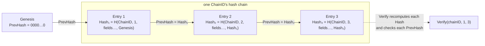
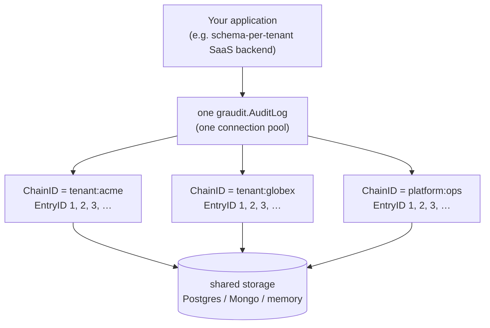

# graudit

Append-only, tamper-evident audit trail for the gourdian ecosystem.

graudit answers "what changed, who did it, and can we prove the record
hasn't been altered" — a different question from what
[grlog](https://github.com/gourdian25/grlog) answers ("what happened during
this request"). It is a library component that could contribute to
SOC2/HIPAA/PCI readiness, not a compliance certification product itself.

## Part of the gourdian25 ecosystem

graudit is one of several small, independent Go libraries meant to be used
together:

- [gourdiantoken](https://github.com/gourdian25/gourdiantoken) — JWT
  access/refresh token issuance, verification, revocation, and rotation.
- [grlog](https://github.com/gourdian25/grlog) — zero-dependency structured
  logging; graudit's optional `Logger` interface is satisfied by it directly.
- [grcache](https://github.com/gourdian25/grcache) — backend-agnostic
  caching abstraction, the same interface-plus-multiple-backends pattern
  graudit uses, both flattened into a single package.
- [grevents](https://github.com/gourdian25/grevents) — an in-process event
  bus; graudit publishes an `"audit.recorded"` event through it on every
  successful write (see below).
- [grpolicy](https://github.com/gourdian25/grpolicy) — attribute-based
  policy evaluation (RBAC/ABAC), independent of any notion of "user" or
  "role".
- [grnoti](https://github.com/gourdian25/grnoti) — a push-notification
  service (FCM dispatch, idempotent event processing, device-token
  management, DLQ retry, circuit breaking, distributed rate limiting,
  deterministic A/B experiment assignment, localization, topic-based
  routing).

## The precise claim (read this before trusting `Verify()`)

Hash-chaining proves **internal consistency**: nothing in the recorded
range was altered or removed without `Verify()` detecting it. It does
**not** prove *who* wrote a given entry beyond whatever `ActorID` the
caller supplied, and it does **not** protect against a privileged attacker
with direct database access regenerating the entire chain from scratch —
a hash chain only detects partial tampering, not wholesale regeneration by
someone who controls the storage. Don't let "tamper-evident" read as
"cryptographically un-forgeable."

## How it works

Every `Record`/`RecordChange` call reads the current tail of the entry's
`ChainID` (its last stored `Hash` and `EntryID`, or the genesis values if
the chain is empty), computes a new `Hash` over the entry's own fields plus
that `PrevHash`, and appends the entry — under a backend-specific
serialization mechanism (a `sync.Mutex` for memory, a
`pg_advisory_xact_lock` for Postgres, a multi-document ACID transaction for
Mongo) so concurrent writers on the *same* chain never race on "what's the
current tail." A best-effort `grevents` publish happens only after the
durable write succeeds:

```mermaid
sequenceDiagram
    participant Caller
    participant AuditLog
    participant Storage as Backend storage
    participant Bus as grevents.Bus

    Caller->>AuditLog: Record(ctx, event{ChainID, ActorID, ...})
    AuditLog->>Storage: lock chain, read tail (last Hash + EntryID)
    Storage-->>AuditLog: PrevHash, lastEntryID (or genesis if empty)
    AuditLog->>AuditLog: Hash = ComputeHash(ChainID, EntryID, ..., PrevHash)
    AuditLog->>Storage: insert entry (EntryID, Hash, PrevHash, Payload, ...)
    Storage-->>AuditLog: committed
    AuditLog-->>Caller: EntryID
    AuditLog--)Bus: PublishRecorded (best-effort; a failure here never fails Record)
```

Each entry's `Hash` links it to the one before it, forming a chain per
`ChainID`. `Verify(ctx, chainID, from, to)` walks a range and fails at the
first entry whose stored `Hash` doesn't match one recomputed from its own
fields (tampering), or whose stored `PrevHash` doesn't match the previous
entry's stored `Hash` (a deleted or reordered entry):



`ChainID` is the first field baked into every `Hash` — not just a
storage/filter column — which is what makes one `AuditLog` instance safe
to share across many independent chains (see
[Multi-chain support](#multi-chain-support) below): tampering can't move an
entry from one chain to another without breaking its hash, since chains
never share a hash namespace even though their `EntryID` sequences both
start at 1.

## Install

```sh
go get github.com/gourdian25/graudit
```

## Quickstart

```go
import (
	"context"
	"log"

	"github.com/gourdian25/graudit"
)

func main() {
	auditLog, err := graudit.NewMemoryAuditLog()
	if err != nil {
		log.Fatal(err)
	}
	defer auditLog.Close()

	ctx := context.Background()
	id, err := auditLog.Record(ctx, graudit.AuditEvent{
		ChainID:    "tenant:acme",
		ActorID:    "user:42",
		EntityType: "invoice",
		EntityID:   "inv_123",
		Action:     "create",
	})
	if err != nil {
		log.Fatal(err)
	}
	log.Println("recorded entry", id)
}
```

See [example/example.go](example/example.go) for a fuller runnable demo
(`Record`, `RecordChange`, `Verify`, `Query`, two independent chains on one
`AuditLog` instance).

## Multi-chain support

Every `Record`/`RecordChange`/`Verify`/`Query` call is scoped by a required
`ChainID`, so one `AuditLog` instance — one connection pool in a networked
backend — can serve any number of independent hash chains at once: `EntryID`
sequences and `PrevHash` linkage are tracked per `ChainID`, not globally.
This is the shape a multi-tenant deployment wants — one chain per tenant,
plus a separate chain for platform-operator actions — without opening one
`AuditLog`/connection pool per tenant.

```go
auditLog.Record(ctx, graudit.AuditEvent{ChainID: "tenant:acme", ActorID: "user:42", /* ... */})
auditLog.Record(ctx, graudit.AuditEvent{ChainID: "platform:ops", ActorID: "operator:jane", /* ... */})

ok, detail, err := auditLog.Verify(ctx, "tenant:acme", 1, latestID)
```



Each chain's `EntryID` sequence restarts at 1 independently and its
`Verify`/`Query` calls never see another chain's rows, even though every
chain lives in the same underlying table/collection — the isolation comes
from the mandatory `ChainID` filter plus `ChainID` being part of every
entry's `Hash`, not from separate storage per chain.

`ChainID` is mandatory everywhere and there is no wildcard/query-all escape
hatch — an empty `ChainID` fails loud with `graudit.ErrChainIDRequired`
rather than silently matching every chain, since a cross-tenant leak in an
audit trail is worse than the ergonomic cost of always specifying one.
`ChainID` is also baked into every entry's `Hash` (see `ComputeHash`), not
just stored as a filter column — otherwise an attacker with direct
database access could splice an entry from one chain into another without
invalidating its hash, since `EntryID` sequences independently restart at
1 in every chain. See [docs/architecture.md](docs/architecture.md)'s
"Multi-chain support" section for the full rationale.

## Backends

graudit is a flat, single package — every backend's constructor and
Config/Option type live directly in `github.com/gourdian25/graudit`, no
subpackages to import selectively. See
[docs/architecture.md](docs/architecture.md) for the full rationale and
each backend's serialization strategy in detail.

| Backend | Constructor | Use case | Serialization |
|---|---|---|---|
| In-memory | `NewMemoryAuditLog` | Test/dev only — never for anything you need to keep | `sync.Mutex` |
| PostgreSQL | `NewPostgresAuditLog` | Production | `pg_advisory_xact_lock` + explicitly-assigned `EntryID` |
| MongoDB | `NewMongoAuditLog` | Production (requires a replica set) | Multi-document ACID transaction |

```go
// Postgres — pgx/v5 with sqlc-generated queries, no ORM.
auditLog, err := graudit.NewPostgresAuditLog(graudit.PostgresConfig{
	DSN: "host=localhost user=myuser password=mypass dbname=mydb port=5432 sslmode=disable",
})

// Or share a pool your application already owns — exactly one of DSN or
// Pool is required. graudit never closes a Pool it didn't dial itself.
auditLog, err := graudit.NewPostgresAuditLog(graudit.PostgresConfig{
	Pool: sharedPool, // *pgxpool.Pool
})

// MongoDB — must be a replica set (single-node is sufficient); construction
// fails fast otherwise, wrapping graudit.ErrReplicaSetRequired.
auditLog, err := graudit.NewMongoAuditLog(graudit.MongoConfig{
	URI:      "mongodb://localhost:27017/?replicaSet=rs0",
	Database: "myapp",
})
```

### Why this shape

graudit used to split Postgres/Mongo/memory into separate importable
subpackages and used GORM for its Postgres backend. Both changed as part
of an ecosystem-wide standardization pass: the backends flattened into
this one root package, and GORM was replaced with `pgx/v5` +
sqlc-generated queries. See [CHANGELOG.md](CHANGELOG.md)'s `[0.3.0]` entry
for the full rationale.

## Thread safety

Every backend's `AuditLog` is safe for concurrent use by multiple
goroutines:

- **In-memory** — a single `sync.Mutex` guards the entry slice, the last
  hash, and the last entry ID together; the same lock doubles as the
  chain's single-writer serialization point, so concurrent `Record` calls
  append in a strictly ordered, non-overlapping sequence.
- **PostgreSQL** — backed by a `pgxpool.Pool`, which pgx itself guarantees
  is safe for concurrent use; chain serialization is a
  `pg_advisory_xact_lock` held for the duration of the transaction, so
  ordering is enforced by Postgres itself, not by a Go-level mutex.
- **MongoDB** — backed by a `*mongo.Client`, which the driver itself
  guarantees is safe for concurrent use; chain serialization is a
  multi-document ACID transaction (`session.WithTransaction`), enforced by
  MongoDB itself, not by a Go-level mutex.

All three backends additionally guard their closed state with an
`atomic.Bool` and make `Close()` idempotent via `sync.Once`, so calling
`Close()` concurrently with in-flight `Record`/`RecordChange`/`Verify`/
`Query` calls is safe — in-flight calls either complete normally or observe
`ErrClosed`.

None of this is optional to verify: `make race` (`go test -race ./...`) is
mandatory before any change touching the hash-chain or serialization code,
and is how the contract suite's `ConcurrentRecordStress` scenario is
actually exercised — see [Testing](#testing) below.

## grevents integration

Every backend accepts an optional [`grevents.Bus`](https://github.com/gourdian25/grevents)
via its `Config`/`Option`, defaulting to `nil` — no bus configured means
`Record` simply doesn't publish, which is not an error. When configured,
every successful `Record`/`RecordChange` publishes one `"audit.recorded"`
event carrying the full recorded `AuditEvent` as `Payload`. A publish
failure is logged, never propagated as a `Record` error — the durable
write is graudit's guarantee, grevents delivery is a best-effort side
channel on top of it.

```go
import "github.com/gourdian25/grevents"

bus, _ := grevents.NewBus()
auditLog, err := graudit.NewPostgresAuditLog(graudit.PostgresConfig{
	DSN:      dsn,
	EventBus: bus,
})
```

## Logger

Every backend accepts an optional `graudit.Logger`
(`Debug`/`Info`/`Warn`/`Error(msg string, args ...any)`, matching
`*slog.Logger`'s own signatures) for diagnostic messages — connection
failures, grevents publish failures, shutdown. A `nil` Logger (the default)
means graudit logs nothing. Any slog-based logger, including one backed by
grlog via [`slog.New(grlog.NewSlogHandler(...))`](https://github.com/gourdian25/grlog),
satisfies this interface with no adapter, the same pattern grcache uses —
see `logger_test.go`'s `TestGrlogSatisfiesLoggerInterface` for the
compile+run proof, and [example/example.go](example/example.go) for a
runnable demo.

```go
import (
	"log/slog"

	"github.com/gourdian25/grlog"
)

logger := slog.New(grlog.NewSlogHandler(grlog.NewDefaultLogger()))
auditLog, err := graudit.NewPostgresAuditLog(graudit.PostgresConfig{
	DSN:    dsn,
	Logger: logger, // *slog.Logger satisfies graudit.Logger directly
})

// memory takes MemoryOption functional options instead of a Config field:
auditLog, err := graudit.NewMemoryAuditLog(graudit.WithLogger(logger))
```

## `Verify()` semantics

```go
ok, detail, err := auditLog.Verify(ctx, chainID, 1, latestID)
if err != nil {
	// operational failure — could not even attempt verification
}
if !ok {
	log.Printf("tampering detected at entry %d: expected %s, got %s",
		detail.BrokenAt, detail.Expected, detail.Actual)
}
```

`Verify` runs two checks per entry: that each entry's stored hash matches
one recomputed from its own stored fields, and that each entry's stored
`PrevHash` matches the immediately preceding entry's stored hash. See
[docs/architecture.md](docs/architecture.md) for why both are needed.

## Testing

graudit's own tests run against real local Postgres/MongoDB instances — no
mocks — mirroring the ecosystem's testing philosophy. These are the same
shared containers grnoti, grcache, and gourdiantoken test against (each
repo gets its own database) — start them with:

```sh
make docker-up   # starts the shared Postgres/Mongo(auth)/Mongo(standalone) test containers
make docker-down # stops them when you're done
```

The root package maintains 95.5% test coverage, enforced by a 95% gate
(`make coverage-check`).

The primary Mongo container is an authenticated single-node replica set —
the workspace-wide standard. A second, genuinely standalone (no `--replSet`,
no auth) instance is also started, required by
`TestNewMongoAuditLog_RequiresReplicaSet` — the one test that actually
proves construction fails fast against a non-replica-set deployment (see
`mongo_test.go`'s comment for why this test must never be skipped: an
earlier version of this exact test caught a real bug where the fail-fast
check silently passed against a standalone instance).

```sh
make fmt              # gofmt
make vet              # go vet ./...
make lint             # golangci-lint run ./...
make test              # go test -cover ./...
make race               # go test -race ./...  (mandatory before any change touching the hash-chain or serialization code)
make coverage-check       # verify the root package meets 95%
```

`make bench` (`go test -bench=. -benchmem -benchtime=10s ./...`) runs this
repo's one `Benchmark*` function,
`BenchmarkPostgresAuditLog_Record_ChainConcurrency` (requires a live
Postgres), comparing concurrent `Record` throughput on one shared chain
against many independent chains — a manually-inspected comparison
demonstrating the advisory-lock chain-scoping in
[docs/architecture.md](docs/architecture.md), not a CI-gated assertion.

A shared contract test suite (`contract_audit_test.go`, run via
`TestAuditLog_Contract`'s per-backend subtests) runs one behavioral suite
(hash-chain integrity, concurrent-write ordering, deliberate-tamper
detection, hash determinism, grevents publish/publish-failure, multi-chain
isolation and tamper containment) against all three backends through the
`AuditLog` interface — folded from a standalone `conformance` package into
the root package's own tests, matching the rest of the gourdian
ecosystem's convention.

## Out of scope (v1)

Full SOC2/HIPAA/PCI/ISO certification tooling, real-time alerting (a
consumer's job, reacting to `"audit.recorded"`), auto-instrumentation
(every entry comes from an explicit `Record`/`RecordChange` call, never
automatic interception), cryptographic per-entry signatures (true
non-repudiation — see the precise claim above), and archival/retention
sweeping of old entries. See
[docs/plan/graudit-plan.md](docs/plan/graudit-plan.md) for the full
roadmap.

## Contributing

1. Fork the repository and create a feature branch off `master`.
2. Make your change, following the conventions in [CLAUDE.md](CLAUDE.md) —
   the `// File: <path>` header on every source file (maintained by the
   `bark` tool), exhaustive doc comments on exported symbols, sentinel
   errors defined once in `errors.go`, `Close()` idempotency, and so on.
3. Run the full test suite and lint locally — see [Testing](#testing)
   above for the exact commands — before opening a pull request. Any
   change touching the hash-chain or serialization code must pass
   `make race`.
4. Open a pull request describing what changed and why.

See [CLAUDE.md](CLAUDE.md) for the full architecture rundown.

## License

MIT — see [LICENSE](LICENSE).

See [CHANGELOG.md](CHANGELOG.md) for release history and
[SECURITY.md](SECURITY.md) to report a vulnerability privately instead of
opening a public issue.
